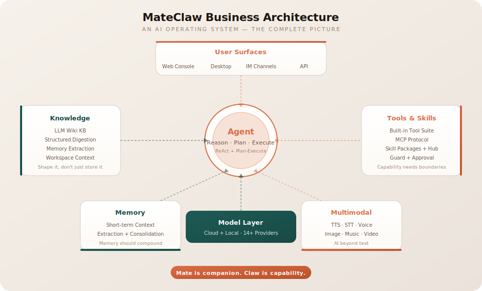
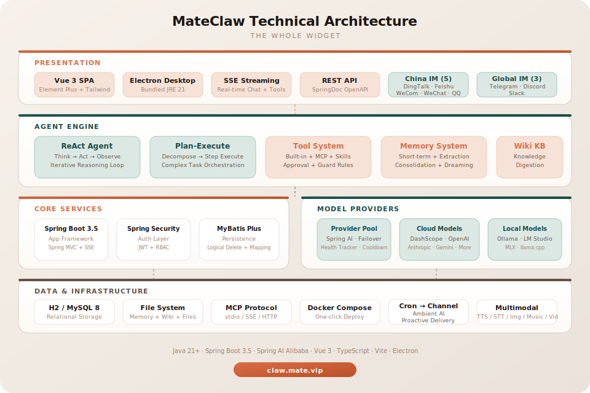

<div align="center">

<p align="center">
  
</p>

# MateClaw

<p align="center"><b>Build AI that thinks, acts, remembers, and ships.</b></p>

[](https://github.com/matevip/mateclaw)
[](https://claw.mate.vip/docs)
[](https://claw-demo.mate.vip)
[](https://claw.mate.vip)
[](https://adoptium.net/)
[](https://spring.io/projects/spring-boot)
[](https://vuejs.org/)
[](https://github.com/matevip/mateclaw)
[](LICENSE)

[[Website](https://claw.mate.vip)] [[Live Demo](https://claw-demo.mate.vip)] [[Documentation](https://claw.mate.vip/docs)] [[中文](README_zh.md)]

</div>

<p align="center">
  
</p>

---

MateClaw is a personal AI operating system built with **Java + Vue 3**, powered by [Spring AI Alibaba](https://github.com/alibaba/spring-ai-alibaba).

Not another chatbox. A complete system where AI agents reason, use tools, build memory, digest knowledge into Wiki pages, create multimodal content, and show up across every channel where work happens.

Three things make it different:

1. **Agents do work, not just talk** — ReAct loops and Plan-and-Execute for real task completion
2. **Knowledge is shaped, not just stored** — An LLM-powered Wiki that digests raw material into structured, linked pages
3. **The whole widget** — One team, one deployment, hardware-to-software vertical integration from desktop app to IM channels

---

## Architecture

<p align="center">
  
</p>

<details>
<summary><b>Technical Architecture</b></summary>
<p align="center">
  
</p>
</details>

---

## Core Capabilities

### Agent Runtime

- **ReAct agents** — Think, act, observe, repeat. Iterative reasoning that gets things done
- **Plan-and-Execute** — Decompose complex work into ordered steps, then execute each one
- **Dynamic configuration** — Load agent personality, tools, and constraints from the database at runtime
- **Runtime resilience** — Context pruning, smart truncation, stale stream cleanup, and recovery

### Knowledge & Memory

- **LLM Wiki** — AI-powered knowledge base that digests raw materials into structured, linked pages with summaries
- **Workspace memory** — `AGENTS.md`, `SOUL.md`, `PROFILE.md`, `MEMORY.md`, daily notes
- **Memory lifecycle** — Post-conversation extraction, scheduled consolidation, dreaming workflows
- **Compound memory** — Understanding improves over time instead of resetting every query

### Tools, Skills & MCP

- **Built-in tools** — Web search, file ops, memory access, date/time, and more
- **MCP integration** — stdio, SSE, and Streamable HTTP transports
- **Skill system** — Installable `SKILL.md` packages with ClawHub marketplace
- **Tool guard** — Approval flows, file-path protection, runtime filtering

### Multimodal Creation

Text-to-speech · Speech-to-text · Image generation · Music generation · Video generation

### Model Flexibility

14+ providers including DashScope, OpenAI, Anthropic, Gemini, DeepSeek, Kimi, Ollama, LM Studio, MLX, and more. Configure everything in the web UI.

### Surfaces

- **Web console** — Chat, agents, tools, skills, knowledge, models, security, settings
- **Desktop app** — Electron with bundled JRE 21, no Java installation needed
- **Channels** — DingTalk, Feishu, WeChat Work, Telegram, Discord, QQ

---

## Quick Start

### Prerequisites

- Java 17+ · Node.js 18+ · pnpm · Maven 3.9+

### Local Development

```bash
# Backend
cd mateclaw-server
mvn spring-boot:run          # http://localhost:18088

# Frontend
cd mateclaw-ui
pnpm install && pnpm dev     # http://localhost:5173
```

Login: `admin` / `admin123`

### Docker

```bash
cp .env.example .env
docker compose up -d          # http://localhost:18080
```

### Desktop App

Download from [GitHub Releases](https://github.com/matevip/mateclaw/releases). Bundles JRE 21 — no Java needed.

---

## Tech Stack

| Layer | Technology |
|-------|------------|
| Backend | Spring Boot 3.5 · Spring AI Alibaba 1.1 |
| Agent | StateGraph Runtime |
| Database | H2 (dev) / MySQL 8.0+ (prod) |
| ORM | MyBatis Plus 3.5 |
| Auth | Spring Security + JWT |
| Frontend | Vue 3 · TypeScript · Vite |
| UI | Element Plus · TailwindCSS 4 |
| Desktop | Electron · electron-updater |

---

## Project Structure

```
mateclaw/
├── mateclaw-server/     Spring Boot backend
├── mateclaw-ui/         Vue 3 SPA frontend
├── mateclaw-desktop/    Electron desktop app
├── docker-compose.yml
└── .env.example
```

---

## Documentation

Full docs at **[claw.mate.vip/docs](https://claw.mate.vip/docs)**

---

## Roadmap

- Richer multi-agent collaboration
- Smarter model routing
- Deeper multimodal understanding
- Stronger long-term memory
- Richer ClawHub ecosystem

---

## Contributing

```bash
git clone https://github.com/matevip/mateclaw.git
cd mateclaw
cd mateclaw-server && mvn clean compile
cd ../mateclaw-ui && pnpm install && pnpm dev
```

---

## Why The Name

**Mate** is companion. **Claw** is capability.

A system that stays with you, and a system that grabs work and moves it.

---

## License

[Apache License 2.0](LICENSE)
